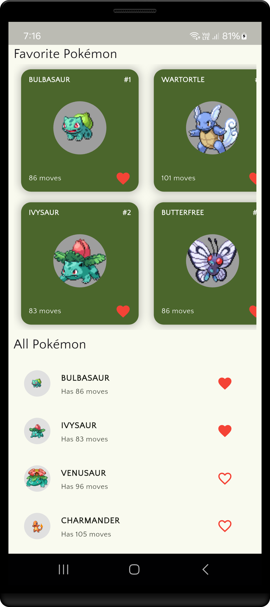

# PokemonVerse - A Flutter Riverpod Project

## Introduction
PokemonVerse is a Flutter application that utilizes the PokeAPI to fetch and display Pokémon data. This project showcases best practices in Flutter development, particularly focusing on state management using Riverpod.

<div align="center">



</div>

### Why Riverpod Instead of BLoC?
Riverpod is a powerful and modern state management solution in Flutter. Here’s why we chose Riverpod over BLoC:
- **Simpler API**: Unlike BLoC, Riverpod reduces boilerplate and provides a more developer-friendly API.
- **Scalability**: It allows dependency injection and easy testing.
- **Performance**: Riverpod eliminates unnecessary widget rebuilds, improving app efficiency.
- **Global State Management**: It works well for managing state globally without the complexity of Streams or Cubits.

## Project Setup
### Step 1: Creating the Flutter Project

To create the project, use the following template:

```sh
flutter create \
  --org com.yourcompany \      # Reverse domain (e.g., com.google)  
  --project-name app_name \    # lowercase_with_underscores  
  --platforms android,ios,web \  # Optional: Skip if you want all platforms  
  ./project_folder            # Where to create the project (`.` for current dir)  
```
<br>

```sh
flutter create \
  --org com.novalogics \
  --project-name pokemon_verse \
  --platforms android,ios \
  -a kotlin \             
  -i swift \           
  --description "A Pokémon collection app" \
  ./pokemon_app 
```
### Step 2: Running the Application
After creating the project, navigate to the project folder and run:
```sh
flutter run
```
If you encounter issues, clean the project using:
```sh
flutter clean
```

## Implementing Riverpod in the Project
### Step 1: Installing Dependencies
Add Riverpod and other necessary dependencies in `pubspec.yaml`:
```yaml
dependencies:
  flutter:
    sdk: flutter
  flutter_riverpod: ^2.6.1
  google_fonts: ^6.2.1
  dio: ^5.8.0+1
  get_it: ^8.0.3
  skeletonizer: ^1.4.3
  shared_preferences: ^2.5.3
```
Then, install dependencies:
```sh
flutter pub get
```

### Step 2: Configuring Riverpod in the Main Application File
Wrap your application in `ProviderScope` to initialize Riverpod globally:
```dart
void main() {
  runApp(const ProviderScope(child: PokemonVerseApp()));
}

class PokemonVerseApp extends StatelessWidget {
  const PokemonVerseApp({super.key});

  @override
  Widget build(BuildContext context) {
    return ProviderScope(
      child: MaterialApp(
        title: 'PokemonVerse',
        theme: ThemeData(
          colorScheme: ColorScheme.fromSeed(seedColor: Colors.lightGreen),
          useMaterial3: true,
          textTheme: GoogleFonts.quattrocentoSansTextTheme(),
        ),
        debugShowCheckedModeBanner: false,
        home: HomeScreen(),
      ),
    );
  }
}
```

## Understanding Riverpod Providers
Riverpod offers multiple providers for state management:
- **Provider**: Read-only state.
- **StateProvider**: Holds mutable state.
- **FutureProvider**: Handles asynchronous state.
- **StreamProvider**: Works with streams.
- **StateNotifierProvider**: Manages complex state changes.

### Step 3: Implementing State Management
#### HomeController - Managing Pokémon Data with `StateNotifierProvider`
```dart
final homeControllerProvider = StateNotifierProvider<HomeController, HomeDataState>((ref) {
  return HomeController(HomeDataState.initial());
});

class HomeController extends StateNotifier<HomeDataState> {
  final HttpService _httpService = GetIt.instance.get<HttpService>();
  static const String _baseUrl = "https://pokeapi.co/api/v2/pokemon";
  static const int _defaultLimit = 20;
  static const int _defaultOffset = 0;

  HomeController(super._state) {
    loadPokemons();
  }

  Future<void> loadPokemons() async {
    final String url = state.data == null ? "$_baseUrl?limit=$_defaultLimit&offset=$_defaultOffset" : (state.data?.next ?? "");
    if (url.isEmpty) return;

    try {
      final Response? response = await _httpService.get(url);
      if (response != null && response.data != null) {
        final PokemonListModel newData = PokemonListModel.fromJson(response.data);
        final PokemonListEntity newDataEntity = newData.toEntity();
        state = state.copyWith(
          data: state.data == null ? newDataEntity : newDataEntity.copyWith(
            results: [...?state.data?.results, ...newDataEntity.results],
          ),
        );
      }
    } catch (e) {
      if (kDebugMode) {
        print("Error loading Pokémon: $e");
      }
    }
  }
}
```

### Step 4: Displaying Pokémon List with Riverpod
```dart
class HomeScreen extends ConsumerStatefulWidget {
  const HomeScreen({super.key});

  @override
  ConsumerState<HomeScreen> createState() => _HomeScreenState();
}

class _HomeScreenState extends ConsumerState<HomeScreen> {
  final ScrollController _scrollController = ScrollController();
  late HomeController _homeController;

  @override
  void initState() {
    super.initState();
    _scrollController.addListener(_onScroll);
  }

  @override
  void dispose() {
    _scrollController.removeListener(_onScroll);
    _scrollController.dispose();
    super.dispose();
  }

  void _onScroll() {
    if (_scrollController.offset >= _scrollController.position.maxScrollExtent && !_scrollController.position.outOfRange) {
      _homeController.loadPokemons();
    }
  }

  @override
  Widget build(BuildContext context) {
    _homeController = ref.watch(homeControllerProvider.notifier);
    final homePageData = ref.watch(homeControllerProvider);

    return Scaffold(
      body: SafeArea(
        child: ListView.builder(
          controller: _scrollController,
          itemCount: homePageData.data?.results.length ?? 0,
          itemBuilder: (context, index) {
            final pokemon = homePageData.data!.results[index];
            return PokemonListTile(pokemonURL: pokemon.url);
          },
        ),
      ),
    );
  }
}
```

## Best Practices
- **Avoid unnecessary rebuilds**: Use `select` to watch only relevant state.
- **Optimize performance**: Use `AutoDispose` for temporary states.
- **Structure your code**: Separate business logic from UI.

